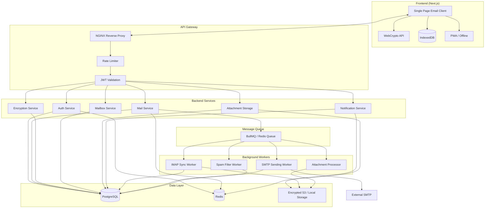

# Secure Email Platform — System Architecture

## 1. High-Level Architecture Diagram

## 2. Zero-Knowledge Model

- **Server never sees**: plaintext email bodies, private keys, user passwords (only Argon2 hashes).
- **Client**: generates key pair, encrypts private key with password-derived key, encrypts email body/attachments before upload.
- **Server**: stores only encrypted blobs and metadata (sender/recipient IDs, timestamps, thread IDs).

## 3. Component Responsibilities

| Component | Responsibility |
|-----------|----------------|
| **API Gateway** | TLS termination, rate limiting, JWT validation, routing |
| **Auth Service** | Registration, login, 2FA (TOTP), sessions, password reset |
| **Mail Service** | Compose, send, list, move, delete; enqueue outbound/sync jobs |
| **Encryption Service** | Store/retrieve encrypted public keys; never touches private keys |
| **Mailbox Service** | Folders, labels, threads, search index (encrypted metadata only) |
| **Attachment Storage** | Store/retrieve encrypted attachment blobs (S3 or local) |
| **Notification Service** | Web push, in-app notifications, new-email alerts |
| **IMAP Sync Worker** | Poll IMAP, store encrypted messages, enqueue spam check, notify client |
| **SMTP Worker** | Dequeue outbound jobs, send via SMTP (SendGrid/SES/Mailgun/self-hosted) |
| **Spam Filter Worker** | DKIM/SPF, scoring, move to Spam folder |
| **Attachment Processor** | Virus scan (optional), thumbnail (optional), store encrypted |

## 4. Data Flow Summary

- **Send**: Browser → encrypt body + attachments → API → store encrypted → queue SMTP job → worker sends via SMTP.
- **Receive**: IMAP worker → fetch raw email → store encrypted body + metadata → queue spam job → notify client → client decrypts in browser.
- **Keys**: Client generates RSA/ECDH + AES keys; private key encrypted with password (client-side); only encrypted private key + public key stored on server.
